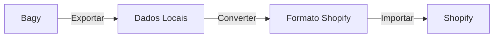

# 🚀 Migração Bagy → Shopify

<div align="center">


**Suite completa de ferramentas para migração de lojas Bagy (Dooca Commerce) para Shopify**

*Automatize a migração de produtos, clientes e cupons com segurança e precisão*

</div>

## 🎯 Por que usar este projeto?

Este projeto oferece uma solução completa e automatizada para migrar sua loja da plataforma **Bagy (Dooca Commerce)** para **Shopify**, economizando tempo e evitando erros manuais. Com ele você pode:

- ⚡ **Economizar tempo**: Migração que levaria dias manualmente é feita em minutos
- 🎯 **Garantir precisão**: Reduz erros humanos na transferência de dados
- 📊 **Manter rastreabilidade**: Relatórios detalhados de cada etapa
- 🔄 **Reprocessar quando necessário**: Execute partes específicas da migração
- 💼 **Preservar SEO**: Gera mapeamento de IDs para redirecionamentos 301

### O que pode ser migrado?

- 📦 **Produtos** - Com variações, preços, imagens, estoque e SEO
- 👥 **Clientes** - Dados completos com endereços e contatos
- 🎟️ **Cupons** - Importação automática via API com códigos e regras
- 🔗 **URLs** - Mapeamento para preservar SEO

## 📂 Organização dos Scripts

Os scripts seguem uma **numeração sequencial** que indica a ordem recomendada de execução:

1. **01-03**: Scripts de **exportação** (extraem dados da Bagy)
2. **04-05**: Scripts de **conversão/importação** (preparam e enviam para Shopify)
3. **06**: Script de **validação** (verifica o sucesso da migração)

Esta numeração facilita a execução em ordem e torna o processo mais intuitivo.

## 📁 Estrutura do Projeto

```
bagy-to-shopify-migration/
│
├── 📋 Scripts de Exportação (Bagy)
│   ├── 01_export_products_from_bagy.py      # Exporta produtos
│   ├── 02_export_customers_from_bagy.py     # Exporta clientes
│   └── 03_export_coupons_from_bagy.py       # Exporta cupons
│
├── 🔄 Scripts de Importação (Shopify)
│   ├── 04_convert_products_to_shopify_csv.py # Converte produtos para CSV
│   └── 05_import_coupons_to_shopify.py      # Importa cupons via API
│
├── 🔍 Scripts de Validação
│   └── 06_validate_migration.py             # Valida e compara migração
│
├── 📂 Pastas de Dados
│   ├── imported/                        # Dados exportados da Bagy
│   │   ├── produtos.json
│   │   ├── produtos_dooca.xlsx
│   │   ├── clientes_dooca.xlsx
│   │   ├── cupons_dooca.xlsx
│   │   └── import_results.json          # Relatório de importação
│   └── converted/                       # Dados convertidos
│       └── produtos_shopify_completo.csv
│
└── ⚙️ Configuração
    ├── .env                             # Credenciais das APIs
    ├── requirements.txt                 # Dependências Python
    └── README.md                        # Esta documentação
```


## 🚀 Instalação e Configuração

### 📋 Pré-requisitos

- 🐍 **Python 3.8** ou superior
- 🌐 **Conexão com internet**
- 🔑 **Credenciais das APIs**:
  - **Bagy**: Token de API
  - **Shopify**: Domínio da loja + Access Token

### ⚡ Instalação Rápida

#### 1. Clone o repositório
```bash
git clone https://github.com/seu-usuario/bagy-to-shopify-migration.git
cd bagy-to-shopify-migration
```

#### 2. Crie um ambiente virtual (recomendado)
```bash
# Windows
python -m venv venv
venv\Scripts\activate

# Linux/Mac
python3 -m venv venv
source venv/bin/activate
```

#### 3. Instale as dependências
```bash
pip install -r requirements.txt
```

Ou instale manualmente:
```bash
pip install requests openpyxl python-dotenv pandas numpy
```

#### 4. Configure as credenciais

Crie um arquivo `.env` na raiz do projeto:
```env
# Credenciais Bagy/Dooca
API_KEY=seu_token_bagy_aqui

# Credenciais Shopify
SHOPIFY_SHOP_DOMAIN=sua-loja.myshopify.com
SHOPIFY_ACCESS_TOKEN=shpat_seu_token_shopify_aqui
```

### 🔑 Obtendo as Credenciais

#### API Bagy
1. Acesse o painel administrativo Bagy
2. Vá em **Configurações** → **API**
3. Clique em **Gerar Token**
4. Copie o token gerado

#### API Shopify
1. Acesse o admin do Shopify
2. Vá em **Apps** → **Develop apps**
3. Crie um novo app privado
4. Em **API credentials**, copie o Access Token
5. Certifique-se de dar permissões para:
   - Produtos (read/write)
   - Clientes (read/write)
   - Descontos (read/write)

⚠️ **IMPORTANTE**: 
- Nunca compartilhe suas credenciais
- Adicione `.env` ao `.gitignore`
- Use credenciais de teste primeiro


## 📖 Guia de Uso Completo

### 🔄 Sequência de Migração Recomendada



### 📥 FASE 1: Exportação da Bagy

#### 1️⃣ Exportar Produtos
```bash
python 01_export_products_from_bagy.py
```
**O que faz:**
- Conecta na API Bagy e baixa todos os produtos
- Processa com paginação automática
- Salva em `imported/produtos.json` e `imported/produtos_dooca.xlsx`

**Dados exportados:**
- ✅ Informações básicas (nome, descrição, SKU)
- ✅ Preços e preços comparativos
- ✅ Estoque de cada variação
- ✅ Imagens (principal e galeria)
- ✅ Variações (cores, tamanhos)
- ✅ Categorias e tags
- ✅ SEO (meta title, description)

**Tempo estimado:** 2-10 minutos (depende da quantidade)

#### 2️⃣ Exportar Clientes
```bash
python 02_export_customers_from_bagy.py
```
**O que faz:**
- Busca todos os clientes cadastrados
- Inclui endereços completos
- Gera `imported/clientes_dooca.xlsx`

**Dados exportados:**
- ✅ Nome, email, telefone
- ✅ CPF/CNPJ
- ✅ Endereços de entrega e cobrança
- ✅ Data de cadastro
- ✅ Status do cliente

#### 3️⃣ Exportar Cupons de Desconto
```bash
python 03_export_coupons_from_bagy.py
```
**O que faz:**
- Baixa todos os cupons ativos e inativos
- Mantém configurações e regras
- Salva em `imported/cupons_dooca.xlsx`

**Dados exportados:**
- ✅ Nome e código do cupom
- ✅ Tipo de desconto (% ou valor fixo)
- ✅ Valor do desconto
- ✅ Regras de aplicação
- ✅ Limites de uso
- ✅ Datas de validade
- ✅ Restrições de produtos/categorias

### 🔄 FASE 2: Conversão e Importação

#### 4️⃣ Converter Produtos para CSV Shopify
```bash
python 04_convert_products_to_shopify_csv.py
```
**O que faz:**
- Lê `imported/produtos.json`
- Converte para formato CSV do Shopify
- Organiza variações corretamente
- Gera `converted/produtos_shopify_completo.csv`

**Regras aplicadas:**
- Variações organizadas por Cor → Tamanho
- Imagens associadas corretamente
- Handle gerado automaticamente
- Campos obrigatórios preenchidos

#### 5️⃣ Importar Cupons para Shopify (Automático)
```bash
python 05_import_coupons_to_shopify.py
```
**Menu interativo:**
```
1. Importar cupons do Excel para Shopify
2. Verificar cupons existentes na Shopify  
3. Testar importação de 1 cupom
4. Sair
```

**Recomendação:** Use a opção 3 primeiro para testar

**O que faz:**
- Lê cupons de `imported/cupons_dooca.xlsx`
- Cria Price Rules via API Shopify
- Gera códigos automaticamente se necessário
- Cria relatório em `imported/import_results.json`

### 📤 FASE 3: Importação Manual no Shopify

#### Para Produtos:
1. Acesse: **Admin Shopify** → **Produtos** → **Importar**
2. Selecione: `converted/produtos_shopify_completo.csv`
3. Revise o mapeamento de campos
4. Execute a importação

#### Para Clientes:
1. Acesse: **Admin Shopify** → **Clientes** → **Importar**
2. Use o arquivo `imported/clientes_dooca.xlsx`
3. Pode ser necessário converter para CSV

### 🔍 FASE 4: Validação e SEO

#### 6️⃣ Gerar Mapeamento de IDs (SEO)
```bash
python 04_convert_products_to_shopify_csv.py
```
**Para que serve:**
- Cria tabela de/para de IDs
- Essencial para redirecionamentos 301
- Preserva rankings no Google

#### 7️⃣ Comparar e Validar
```bash
python 06_validate_migration.py
```
**O que verifica:**
- Integridade dos dados migrados
- Produtos faltantes
- Discrepâncias de preços/estoque
- Gera relatório de validação


## 📊 Mapeamento de Dados Detalhado

### Cupons de Desconto (Bagy → Shopify)

| Campo Bagy | Campo Shopify | Tipo | Observações |
|------------|---------------|------|-------------|
| `name` | `title` | String | Nome do cupom |
| `code` | `code` | String | Se vazio, gera automaticamente |
| `value_type` | `value_type` | Enum | `percentage` ou `fixed_amount` |
| `value` | `value` | Number | Negativo no Shopify |
| `single_usage` | `once_per_customer` | Boolean | Uso único por cliente |
| `usage_limit` | `usage_limit` | Integer | Limite total |
| `date_from` | `starts_at` | DateTime | Data início |
| `date_to` | `ends_at` | DateTime | Data fim |
| `min_purchase` | `prerequisite_subtotal_range` | Object | Valor mínimo |
| `min_quantity` | `prerequisite_quantity_range` | Object | Qtd mínima |
| `active` | - | Boolean | Só importa ativos |

### Produtos (Bagy → Shopify CSV)

| Campo Bagy | Campo Shopify | Observações |
|------------|---------------|-------------|
| `name` | `Title` | Nome do produto |
| `description` | `Body (HTML)` | Descrição completa |
| `sku` | `Variant SKU` | Código único |
| `price` | `Variant Price` | Preço de venda |
| `compare_at_price` | `Variant Compare At Price` | Preço riscado |
| `stock` | `Variant Inventory Qty` | Estoque |
| `weight` | `Variant Weight` | Peso em gramas |
| `images` | `Image Src` | URLs das imagens |
| `categories` | `Type` | Tipo de produto |
| `tags` | `Tags` | Separadas por vírgula |
| `brand` | `Vendor` | Marca/fornecedor |

## ⚙️ Regras Específicas de Conversão

### 🎨 Variações de Produtos
- 🎨 **Option1**: Cor (sempre primeiro)
- 📏 **Option2**: Tamanho (sempre segundo)  
- 📊 **Ordenação**: Azul-P, Azul-M, Azul-G → Verde-P, Verde-M, Verde-G

### 📄 Estrutura do CSV
- **Primeira linha**: Dados completos do produto + primeira variação
- **Linhas seguintes**: Apenas Handle + dados das variações adicionais
- **Linhas de imagem**: Apenas Handle + dados da imagem

### 🖼️ Tratamento de Imagens
- ✅ Primeira imagem do produto na primeira linha
- ✅ Imagens de variação específicas quando disponíveis
- ✅ Imagens adicionais em linhas separadas

### 📋 Dados Obrigatórios
- **Handle** - Gerado automaticamente do nome
- **Title** - Nome do produto
- **Vendor** - Marca ou "Marca" como padrão
- **Price** - Preço da variação ou produto
- **Inventory Qty** - Estoque disponível

## 💡 Exemplos Práticos

### Exemplo 1: Migração Completa
```bash
# 1. Exportar tudo da Bagy (execute em ordem)
python 01_export_products_from_bagy.py
python 02_export_customers_from_bagy.py  
python 03_export_coupons_from_bagy.py

# 2. Converter produtos para formato Shopify
python 04_convert_products_to_shopify_csv.py

# 3. Importar cupons automaticamente via API
python 05_import_coupons_to_shopify.py
# Escolha opção 1 para importar todos

# 4. Validar a migração
python 06_validate_migration.py
```

### Exemplo 2: Apenas Cupons de Desconto
```bash
# Exportar cupons da Bagy
python 03_export_coupons_from_bagy.py

# Importar para Shopify via API
python 05_import_coupons_to_shopify.py
# Escolha opção 3 para testar com 1 cupom
# Depois opção 1 para importar todos
```

### Exemplo 3: Reprocessar Produtos
```bash
# Se já tem o arquivo produtos.json
python 04_convert_products_to_shopify_csv.py
# Arquivo CSV atualizado será gerado em converted/
```

### Exemplo 4: Execução Sequencial Completa
```bash
# Execute todos os scripts em ordem
for script in 0*.py; do
    echo "Executando $script..."
    python "$script"
done
```


## 🐛 Solução de Problemas

### Problemas Frequentes

#### ❌ "API_KEY not found"
```bash
# Verifique o arquivo .env
cat .env
# Deve conter: API_KEY=seu_token_aqui
```

#### ❌ "401 Unauthorized" (Shopify)
- Token deve começar com `shpat_`
- Verifique permissões do app privado
- Confirme o domínio da loja

#### ❌ "422 Unprocessable Entity" (Cupons)
- Cupom com código duplicado
- Datas inválidas (passadas)
- Valor de desconto incorreto

#### ❌ "Rate limit exceeded"
- Scripts têm delay automático
- Se persistir, aguarde 5 minutos
- Máximo API Shopify: 2 requests/segundo

#### ❌ Cupons sem código na Bagy
- Script gera códigos automaticamente
- Baseado no nome do cupom
- Máximo 20 caracteres

#### ❌ Produtos não importando
- Verifique o CSV no Excel primeiro
- Confirme encoding UTF-8
- Imagens devem ser URLs públicas

### 📊 Monitoramento e Logs

#### Durante a execução:
```
🔎 Total de páginas: 7
🎟️ Total de cupons: 167
➡️  Processando página 1 de 7...
✅ Arquivo salvo como imported/cupons_dooca.xlsx
```

#### Relatórios gerados:
- `imported/import_results.json` - Resultado das importações
- `imported/import_results_[timestamp].json` - Histórico
- Logs detalhados no console

## 🚀 Dicas de Performance

### Para grandes volumes:
- **Produtos**: Processe em lotes de 1000
- **Clientes**: Importe em grupos de 5000
- **Cupons**: Máximo 50 por vez na API

### Tempos estimados:
- 1000 produtos: ~5 minutos
- 5000 clientes: ~3 minutos
- 100 cupons: ~2 minutos

### Limites das APIs:
- **Bagy**: 1000 requests/hora
- **Shopify**: 2 requests/segundo
- **Delay automático**: 350ms (Bagy), 500ms (Shopify)

## 🔒 Segurança e Boas Práticas

### Recomendações:
1. **Sempre faça backup** antes de importar
2. **Teste em loja de desenvolvimento** primeiro
3. **Nunca commite o arquivo `.env`**
4. **Use tokens com permissões mínimas**
5. **Valide os dados** após cada importação

### Checklist pré-migração:
- [ ] Backup dos dados atuais
- [ ] Credenciais configuradas
- [ ] Ambiente de teste preparado
- [ ] Plano de rollback definido
- [ ] Horário de menor movimento escolhido

## 🤝 Contribuindo

Contribuições são bem-vindas! 

### Como contribuir:
1. Faça um Fork do projeto
2. Crie uma branch (`git checkout -b feature/NovaFuncionalidade`)
3. Commit suas mudanças (`git commit -m 'Add: nova funcionalidade'`)
4. Push para a branch (`git push origin feature/NovaFuncionalidade`)
5. Abra um Pull Request

### Ideias para contribuição:
- [ ] Interface gráfica (GUI)
- [ ] Importação de pedidos
- [ ] Suporte a mais plataformas
- [ ] Testes automatizados
- [ ] Docker container

## 📝 Licença

Este projeto está sob a licença MIT. Veja o arquivo [LICENSE](LICENSE) para mais detalhes.

## 🙏 Agradecimentos

- Comunidade Python
- Documentação Shopify API
- Usuários beta testers

## 📞 Suporte

- **Issues**: [GitHub Issues](https://github.com/seu-usuario/bagy-to-shopify-migration/issues)
- **Discussões**: [GitHub Discussions](https://github.com/seu-usuario/bagy-to-shopify-migration/discussions)
- **Wiki**: [Documentação completa](https://github.com/seu-usuario/bagy-to-shopify-migration/wiki)

---

<div align="center">

**📅 Julho 2025** | **🐍 Python 3.8+** | **📝 MIT License**

*Desenvolvido para facilitar a migração Bagy → Shopify*

</div>=
